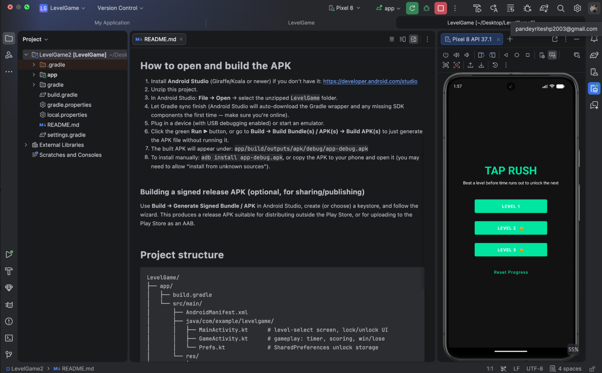
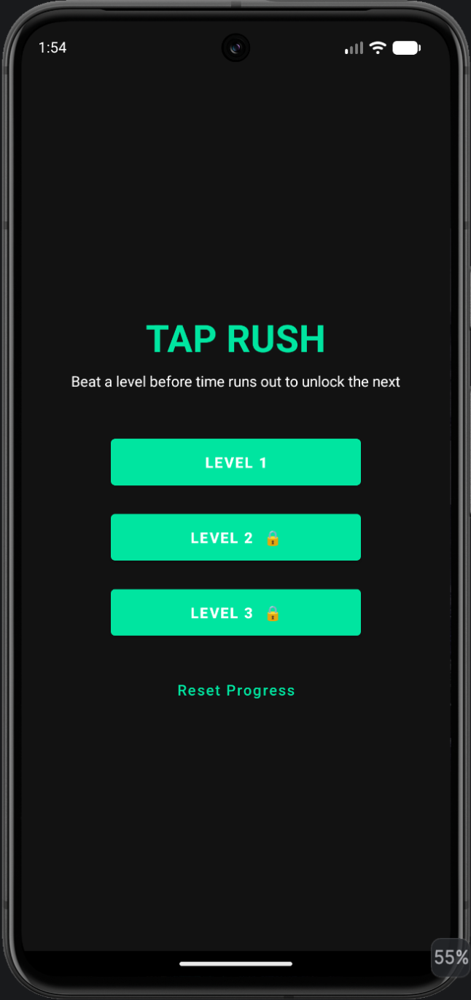
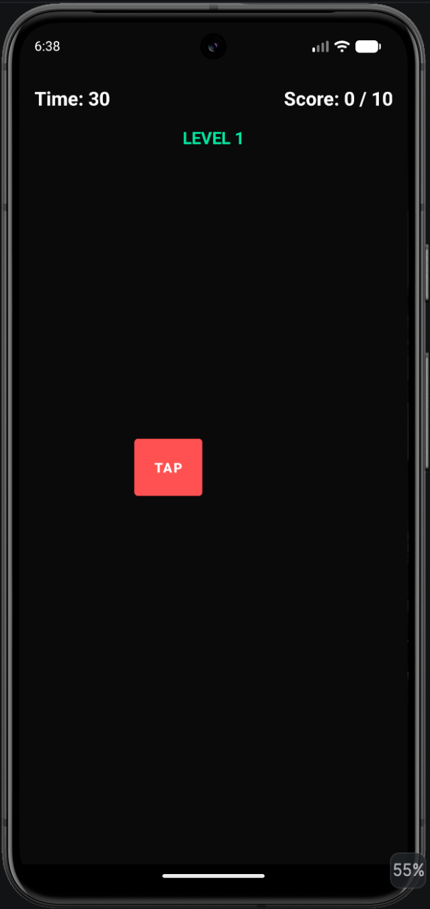
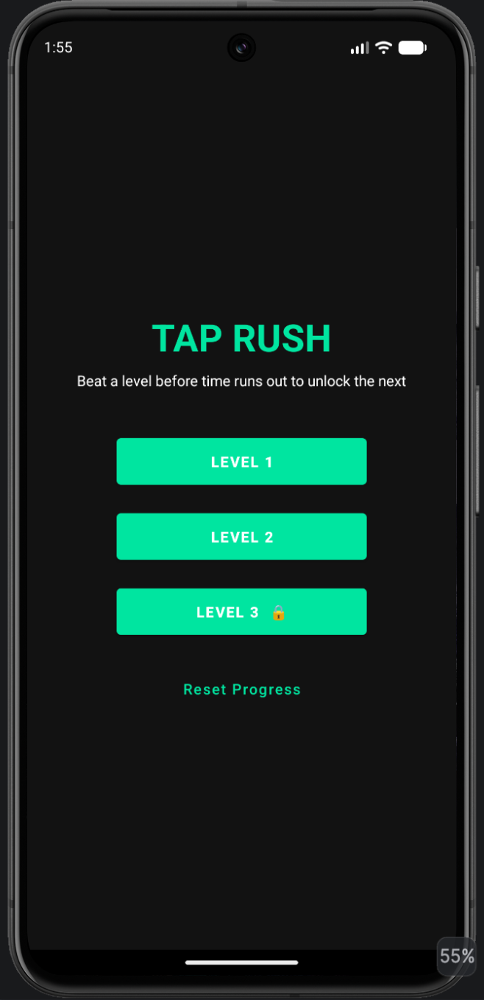
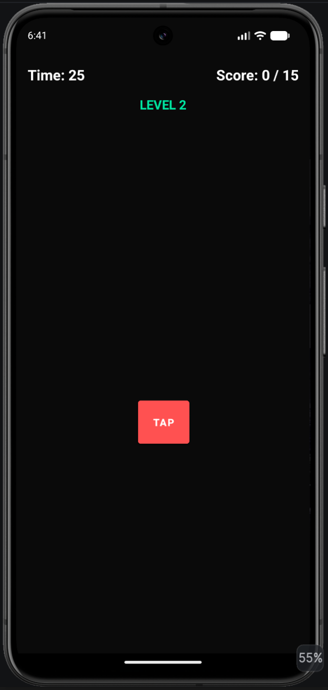
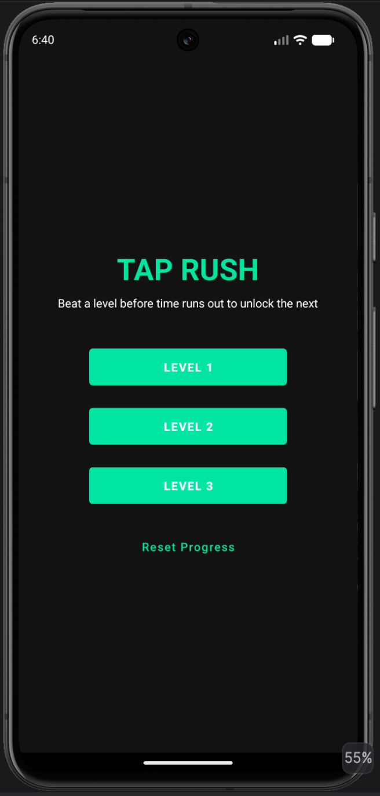
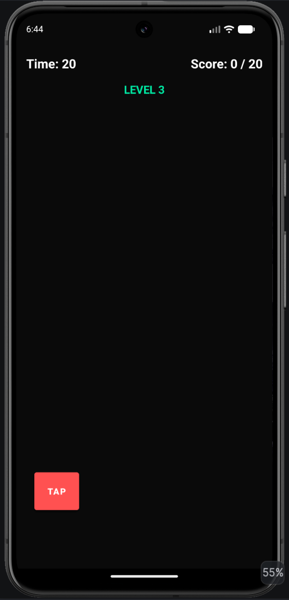
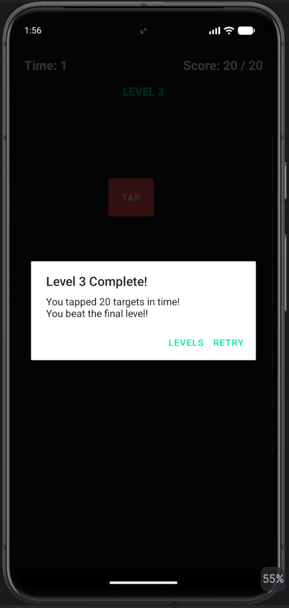

# TapRush — 3-Level Android Game (Android Studio Project)

A simple tap-the-moving-target game with 3 levels, per-level countdown timers,
and level-unlock progression saved on the device.

## How the game works
- **Level 1**: tap the target 10 times within 30 seconds.
- **Level 2**: tap the target 15 times within 25 seconds. Locked until Level 1 is won.
- **Level 3**: tap the target 20 times within 20 seconds. Locked until Level 2 is won.
- Progress (which levels are unlocked) is saved with `SharedPreferences`, so it
  persists even after closing the app. Use the "Reset Progress" button on the
  home screen to start over.

You can change the difficulty/timing per level by editing `levelConfig` in
`GameActivity.kt`.

--- 

##  Application Demonstration

This section demonstrates the complete user flow of **Tap Rush**, from launching the application to completing all three levels.

### 1. Android Studio Project and Application

The project is opened in Android Studio and the application is run on the Android emulator.



### 2. Starting Screen — Level Selection

When the application starts, the player sees the **Tap Rush** home screen. Level 1 is available immediately, while Level 2 and Level 3 are locked. The home screen also provides a **Reset Progress** option.



### 3. Level 1 — First Challenge

The player selects **Level 1**. The player must achieve **10 taps within 30 seconds**.



### 4. Level 1 Completed — Level 2 Unlocked

After successfully completing Level 1, the level-selection screen shows that **Level 2 is unlocked**, while Level 3 remains locked.



**Progression:** `Win Level 1 → Unlock Level 2`

### 5. Level 2 — Second Challenge

The player can now select **Level 2**. The player must achieve **15 taps within 25 seconds**.



### 6. Level 2 Completed — Level 3 Unlocked

After successfully completing Level 2, **Level 3 becomes unlocked**.



**Progression:** `Win Level 2 → Unlock Level 3`

### 7. Level 3 — Final Challenge

Level 3 is the final challenge. The player must achieve **20 taps within 20 seconds**.



### 8. Level 3 Completed — Game Finished

After achieving all 20 required taps before the timer expires, the completion dialog confirms that the final level has been beaten. The player can select **LEVELS** to return to the level-selection screen or **RETRY** to replay Level 3.



---

##  Complete Game Flow

```text
Launch Tap Rush
      ↓
Level Selection
      ↓
Level 1 — Unlocked
10 taps / 30 sec
      ↓ WIN
Level 2 — Unlocked
15 taps / 25 sec
      ↓ WIN
Level 3 — Unlocked
20 taps / 20 sec
      ↓ WIN
Game Completed
```


## How to open and build the APK

1. Install **Android Studio** (Giraffe/Koala or newer) if you don't have it:
   https://developer.android.com/studio
2. Unzip this project.
3. In Android Studio: **File → Open** → select the unzipped `LevelGame` folder.
4. Let Gradle sync finish (Android Studio will auto-download the Gradle
   wrapper and any missing SDK components the first time — make sure you're
   online).
5. Plug in a device (with USB debugging enabled) or start an emulator.
6. Click the green **Run ▶** button, or go to
   **Build → Build Bundle(s) / APK(s) → Build APK(s)** to just generate the
   APK file without running it.
7. The built APK will appear under:
   `app/build/outputs/apk/debug/app-debug.apk`
8. To install manually: `adb install app-debug.apk`, or copy the APK to your
   phone and open it (you may need to allow "install from unknown sources").

### Building a signed release APK (optional, for sharing/publishing)
Use **Build → Generate Signed Bundle / APK** in Android Studio, create (or
choose) a keystore, and follow the wizard. This produces a release APK
suitable for distributing outside the Play Store, or for uploading to the
Play Store as an AAB.

## Project structure
```
LevelGame/
├── app/
│   ├── build.gradle
│   └── src/main/
│       ├── AndroidManifest.xml
│       ├── java/com/example/levelgame/
│       │   ├── MainActivity.kt      # level-select screen, lock/unlock UI
│       │   ├── GameActivity.kt      # gameplay: timer, scoring, win/lose
│       │   └── Prefs.kt             # SharedPreferences unlock storage
│       └── res/
│           ├── layout/activity_main.xml
│           ├── layout/activity_game.xml
│           └── values/ (strings, colors, theme)
├── build.gradle
└── settings.gradle
```

## Customizing
- **Change difficulty**: edit the `levelConfig` map at the top of
  `GameActivity.kt` (targets needed + time limit per level).
- **Add more levels**: add an entry to `levelConfig`, add a button in
  `activity_main.xml`, wire it up in `MainActivity.kt`, and bump
  `Prefs.MAX_LEVEL`.
- **Change the game itself**: the win condition and target behavior live in
  `GameActivity.kt` — swap the tap-the-button mechanic for whatever gameplay
  you want (a maze, a quiz, a runner, etc.) while keeping the same timer +
  unlock scaffolding.
# TopRush

--- 

##  Level Unlocking Rules

| Level | Requirement | Time Limit | Unlock Condition |
|---|---|---:|---|
| Level 1 | 10 taps | 30 seconds | Unlocked initially |
| Level 2 | 15 taps | 25 seconds | Unlocks after Level 1 is won |
| Level 3 | 20 taps | 20 seconds | Unlocks after Level 2 is won |

The unlock progress is saved on the device using `SharedPreferences`, so unlocked levels remain available after closing the application. The **Reset Progress** button can be used to restart the progression.

##  Final User Journey

**Launch App → Select Level 1 → Win Level 1 → Level 2 Unlocks → Win Level 2 → Level 3 Unlocks → Win Level 3 → Game Completed**
